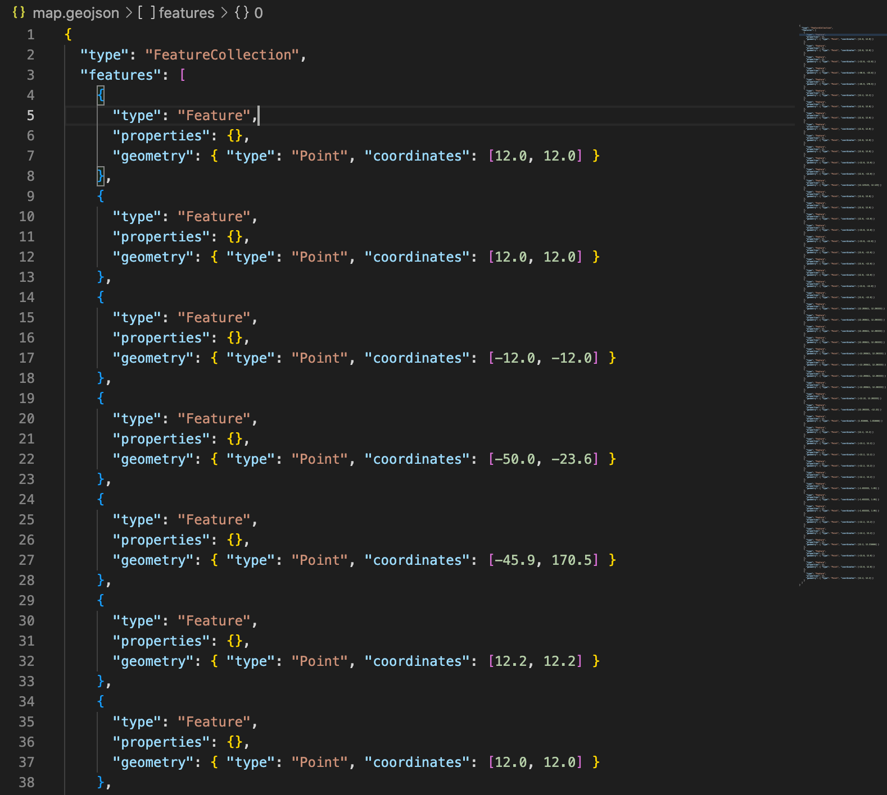
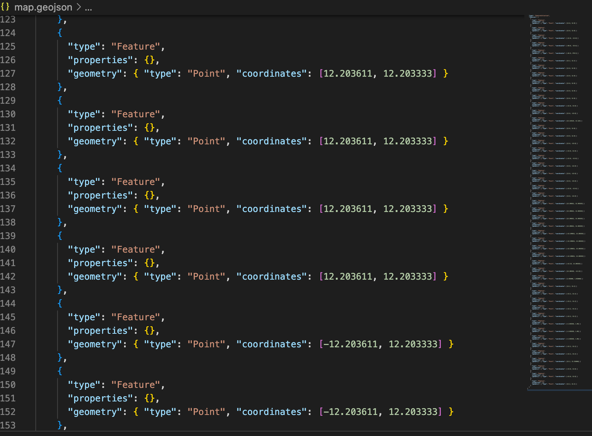
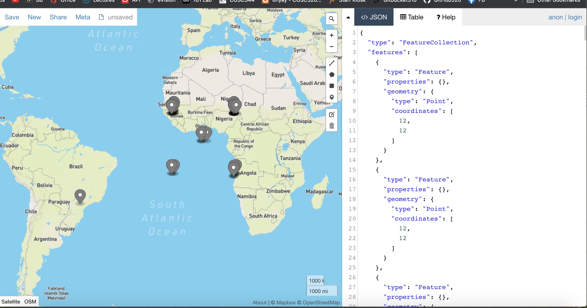

# Etude 7 Where in the World

## To compile the program

To compile the program, please run the following commands

`javac WhereInTheWorld2.java`

## To run the program

Please run the following command to run the application

`java WhereInTheWorld2`

This will then allow the user to enter in values via the terminal

Alternativly, you can compile and pass in a txt file with the inputs.

'java WhereInTheWorld2 < input.txt'

## Test cases

I have been using the input.txt file as my test cases

## My Approach

I have used two regular expressions for standard latitude and longitude that I use to compare my final converted and validated version of the users input. If they match I add the values to a string along with the nessacery syntax needed for a GEOjson file.

Once the user has finished entering values or all the values have been read from the file, the program writes the string into a GEOjson file. This file is now able to represent coordinates.

## Screen Shots

These are screen shots of my GEOjson file after processing input.txt and the same file being inserted into geojson.io

## My Approach Continued

When it came to validating and converting different representations of latitude and longitude, I first dealt with cleaning the string of unwanted extra characters then converted any North, South, East, and West labels into being represented by a negative sign instead, while at the same time, ensuring that the labels used where valid.

I then used the length of the users Input once split into an array to determine what method was needed to convert the values into valid lat and long, doing validation on the values along the way.

I then compared the converted values to the regex to determine whether they were valid coordinates or not.
